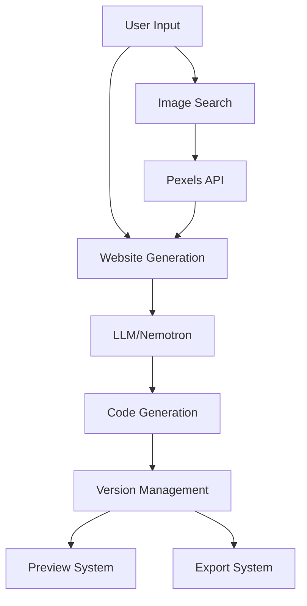

# Ghata-AI-Powered-website-generation-tool_v2.5.0 (Latest/Stable)
My final year project and version 2 of https://github.com/Just-a-code-lover/Ghata-AI-Powered-website-generation-tool_v1.0.0


# Ghata AI Website Generator - Technical Documentation

## Core Components

### 1. AI Website Generation Engine
- **Key File**: llm_handler.py
- **Main Functions**:
  - `generate_response()` - Handles API communication with NVIDIA's Nemotron model
  - `get_system_prompt()` - Manages the system prompt with detailed instructions
  - `extract_code_from_response()` - Parses HTML, CSS, and JS from AI responses

### 2. Version Control System
- **Key Files**: 
  - website_version.py - Version data structure
  - app_utilities.py - State management
- **Features**:
  - Unique ID generation for each version
  - Timestamp tracking
  - Version history navigation
  - State persistence between sessions

### 3. UI Components
- **Key File**: ui_components.py
- **Major Components**:
  - Custom header and styling
  - Chat interface
  - Code display panels
  - Version history cards
  - Download buttons

### 4. Image Integration
- **Key File**: image_handler.py
- **Main Function**: `get_images_from_pexels()`
- **Features**:
  - Pexels API integration
  - Image metadata handling
  - Dynamic image search

### 5. File Management
- **Key File**: file_handler.py
- **Main Functions**:
  - `create_download_zip()` - Single version export
  - `create_all_versions_zip()` - Multiple version export
  - File structure organization

## Key Features & Implementation

### 1. Website Generation Process
```python
# In app.py
def main():
    # User input handling
    with chat_tab:
        user_input = st.text_area(...)
        image_query = st.text_input(...)
        
    # Generation process
    if st.session_state.submitted:
        # Get images if requested
        image_data = get_images_from_pexels(image_query, num_images)
        
        # Generate website
        system_prompt = get_system_prompt(image_data)
        response = generate_response(user_input, history, system_prompt)
        
        # Extract and save code
        html_code, css_code, js_code = extract_code_from_response(response)
```

### 2. Version Management
```python
# In website_version.py
class WebsiteVersion:
    def __init__(self, html="", css="", js="", description=""):
        self.id = str(uuid.uuid4())[:8]  # Unique version ID
        self.timestamp = datetime.datetime.now().strftime("%Y-%m-%d %H:%M:%S")
        # ... store code and description
```

### 3. UI Layout
```python
# In app.py
def render_website_preview():
    tab1, tab2, tab3, tab4 = st.tabs(["Preview", "HTML", "CSS", "JavaScript"])
    # Each tab shows different aspects of the generated website
```

### 4. State Management
```python
# In app_utilities.py
def initialize_session_state():
    # Initialize all required session variables
    if "messages" not in st.session_state:
        st.session_state.messages = []
    if "website_versions" not in st.session_state:
        st.session_state.website_versions = []
```

## Technical Features

1. **Stateless Architecture with State Management**
   - Uses Streamlit's session state
   - Maintains conversation history
   - Preserves version history

2. **Modular Design**
   - Separated concerns (UI, LLM, file handling)
   - Easy to extend or modify components
   - Clean code organization

3. **Error Handling & Safety**
   - API error handling
   - Input validation
   - Safe file operations

4. **User Experience**
   - Live preview
   - Code highlighting
   - Responsive design
   - Interactive version management

## File Structure
```
project/
├── app.py              # Main application
├── llm_handler.py      # AI model integration
├── image_handler.py    # Pexels API integration
├── website_version.py  # Version management
├── file_handler.py     # File operations
├── ui_components.py    # UI elements
└── app_utilities.py    # Utilities and state management
```

# Ghata AI Website Generator - System Architecture

## 1. Core Components & Data Flow

### 1.1 Frontend Layer (Streamlit UI)
- **Main Layout** (`app.py`, Lines 318-332):
```python
def main():
    st.set_page_config(layout="wide")
    initialize_session_state()
    load_custom_css()
    create_custom_header()
    
    # Two-panel layout
    left_panel, right_panel = st.columns([1, 3])
```

### 1.2 State Management
- **Session State** (`app_utilities.py`, Lines 5-23):
```python
def initialize_session_state():
    if "messages" not in st.session_state:
        st.session_state.messages = []
    if "website_versions" not in st.session_state:
        st.session_state.website_versions = []
    if "current_version_index" not in st.session_state:
        st.session_state.current_version_index = -1
```

## 2. Key System Workflows

### 2.1 Website Generation Pipeline
1. **User Input Processing** (`app.py`, Lines 330-384):
   ```python
   # 1. Collect user input
   user_input = st.text_area(...)
   image_query = st.text_input(...)
   
   # 2. Process image requests
   if image_query:
       image_data = get_images_from_pexels(image_query, num_images)
   
   # 3. Generate website
   response = generate_response(user_input, history, system_prompt)
   html_code, css_code, js_code = extract_code_from_response(response)
   ```

<pre> ```mermaid graph TD A[Base System Prompt] --> B[Code Completeness Rules] A --> C[Image Integration Logic] A --> D[Stateless Architecture] B --> E[Full Code Return] B --> F[Feature Preservation] C --> G[Pexels Image Data] C --> H[Fallback Placeholders] D --> I[Version Context] D --> J[Conversation History] E & F & G & H & I & J --> K[Final Composite Prompt] K --> L[LLM/Nemotron] ``` </pre>

2. **Version Management** (`website_version.py`, Lines 4-15):
   ```python
   class WebsiteVersion:
       def __init__(self, html="", css="", js="", description=""):
           self.id = str(uuid.uuid4())[:8]
           self.timestamp = datetime.datetime.now()
           self.html = html
           self.css = css
           self.js = js
   ```
graph TD
    A[User Input] --> B{Has Previous Version?}
    B -->|Yes| C[Load Current Version]
    B -->|No| D[Initialize New Version]
    
    C --> E[Current State]
    D --> E
    
    E --> F[Generate New Version]
    F --> G[Version Object Creation]
    
    G --> H[Add to Version History]
    H --> I[Update Current Index]
    
    I --> J{Multiple Versions?}
    J -->|Yes| K[Enable Version Navigation]
    J -->|No| L[Single Version Mode]
    
    K & L --> M[State Management]
    
    M --> N[Save Version State]
    N --> O[Load Version State]
    
    style A fill:#4b6cb7,color:white
    style E fill:#182848,color:white
    style M fill:#4CAF50,color:white

    subgraph Version Object
        G --> |Contains| V1[UUID]
        G --> |Contains| V2[Timestamp]
        G --> |Contains| V3[HTML/CSS/JS]
        G --> |Contains| V4[Description]
    end

### 2.2 AI Integration
- **LLM Handler** (`llm_handler.py`, Lines 144-182):
```python
def generate_response(prompt, conversation_history=None, custom_system_prompt=None):
    client = OpenAI(
        base_url="https://integrate.api.nvidia.com/v1",
        api_key=os.environ.get("NVIDIA_API_KEY")
    )
    messages = [{"role": "system", "content": system_prompt}]
    # ... handling conversation and response
```

### 2.3 Image Integration
- **Pexels API Handler** (`image_handler.py`, Lines 4-31):
```python
def get_images_from_pexels(query: str, per_page: int = 5) -> List[Dict]:
    api_key = os.getenv("PEXELS_API_KEY")
    headers = {"Authorization": api_key}
    # ... API request and response processing
```

## 3. Data Persistence & Export

### 3.1 File Management
- **ZIP Export** (`file_handler.py`, Lines 6-45):
```python
def create_download_zip(version):
    with zipfile.ZipFile(zip_buffer, "w") as zipf:
        zipf.writestr("index.html", ...)
        zipf.writestr("styles.css", version.css)
        zipf.writestr("script.js", version.js)
```

### 3.2 State Persistence
```python
def save_state_to_file(filename="website_state.json"):
    data = {
        "messages": st.session_state.messages,
        "website_versions": [v.to_dict() for v in st.session_state.website_versions],
        "current_version_index": st.session_state.current_version_index
    }
```

## 4. UI Components

### 4.1 Custom Styling
- **CSS Management** (`ui_components.py`, Lines 1-180):
```python
def load_custom_css():
    st.markdown("""
        <style>
        .scrollable-container {
            max-height: 500px !important;
            overflow: auto !important;
        }
        /* ... other styles */
        </style>
    """)
```

### 4.2 Preview System
- **Website Preview** (`app.py`, Lines 150-190):
```python
def render_website_preview():
    tab1, tab2, tab3, tab4 = st.tabs(["Preview", "HTML", "CSS", "JavaScript"])
    # ... rendering logic for each tab
```

## 5. System Flow Diagram


## 6. Key Features

### 6.1 Stateless Architecture
- Maintains conversation context through session state
- Preserves version history
- Handles image metadata

### 6.2 Error Handling
- API fallbacks
- Input validation
- State management safety checks

### 6.3 Modular Design
- Separated concerns (UI, LLM, file handling)
- Easy to extend
- Clean component isolation

This architecture provides a robust foundation for:
- Scalable website generation
- Version control
- Image integration
- Code preview and export
- User interaction management
